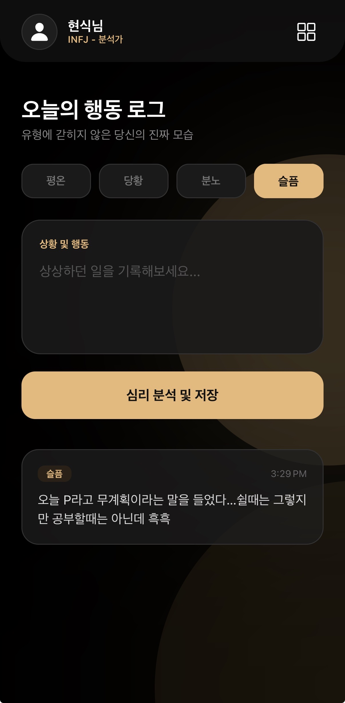
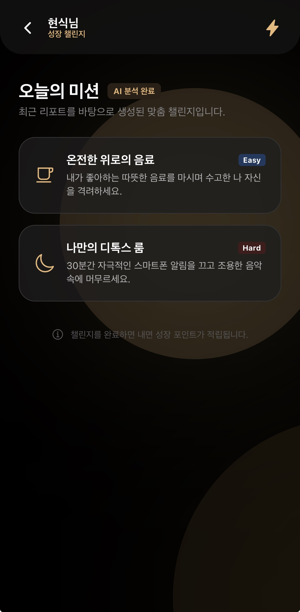
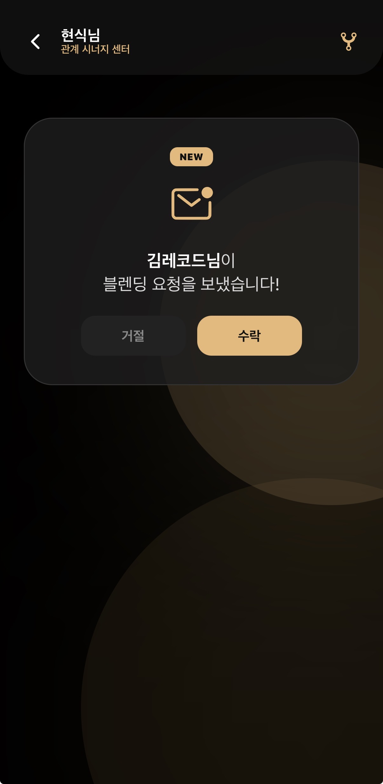
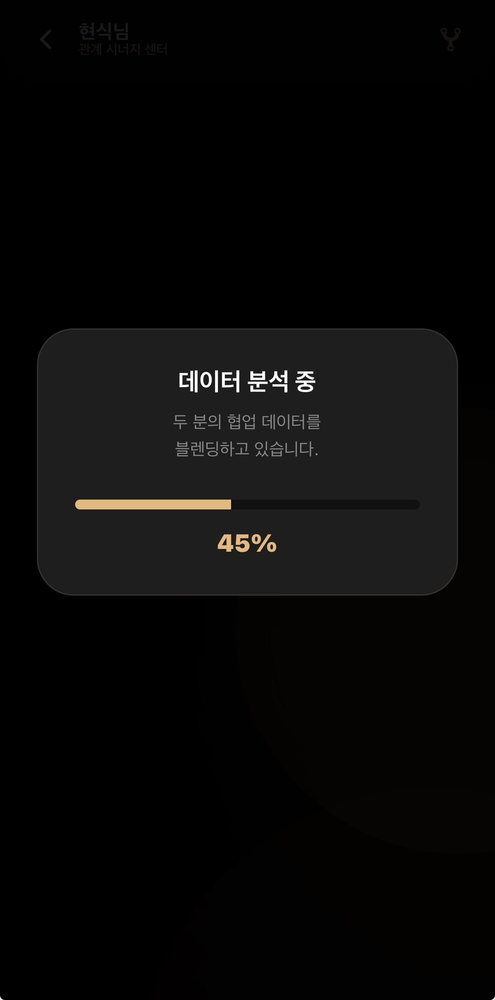
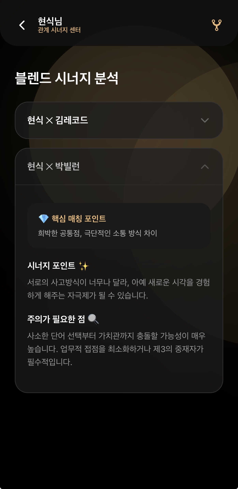
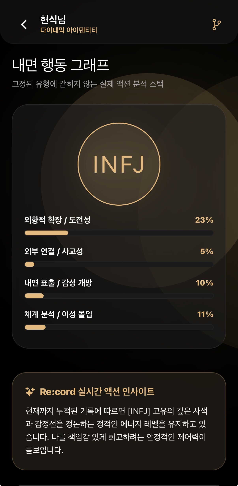
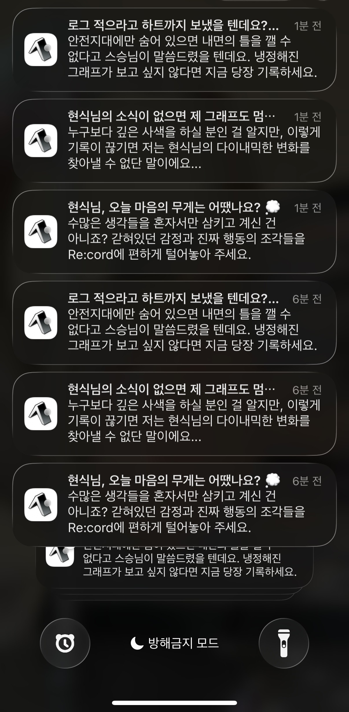

# Re-cord

멋사 14기 아이디어톤 5팀 Re:cord 레포지토리

# Re-cord란?

Re:cord는 사용자의 감정과 행동 기록을 기반으로
자신의 반복 패턴과 관계 속 소통 방식을 분석해주는 서비스입니다.

기존 MBTI 문화에서는
사람을 쉽게 이해할 수 있다는 장점이 있었지만,
동시에 “나는 T라서 공감 못 해”, “걔 P잖아”처럼
사람을 단정하거나 관계를 단순하게 판단하는 문제가 발생했습니다.

이를 해결하기 위해 Re:cord는
사용자의 일상 기록을 AI로 분석하여
고정된 성격 유형이 아니라
“어떤 상황에서 어떻게 반응하는 사람인지”를 보여줍니다.

또한 관계 블렌드와 마이크로 챌린지를 통해
단순한 자기이해에서 끝나지 않고,
실제 관계 속 행동 변화까지 이어지도록 기획했습니다.

# 사용 방법

1. 클론 후, npm install을 통해 패키지를 다운로드 받습니다.
2. npm start를 입력하여 프로젝트를 실행시킵니다.
3. 핸드폰에 expo go를 설치하여 접속합니다. (실행하는 노트북과 핸드폰의 와이파이가 동일해야합니다!)
4. Re:cord를 만나볼까요?

# 실행 시, 앱 모습

1. 감정로그 작성
   
2. 마이크로 챌린지
   
3. 블렌드를 통한 타인과 나에 대한 분석
   
   
   
4. 하루하루 감정로그를 적으며 변화하는 나
   
5. 앱의 알림을 통해 사용자를 이끄는 메시지
   

# 참고사항

1. 현재 Re:cord는 기본 기능만 구현되어있는 상태입니다.
2. 현재는 서버가 존재하지 않아, 클라이언트 자체에 기록되는 방식이오니, 앱을 껐다키면 사라지니 주의해주시기 바랍니다.
